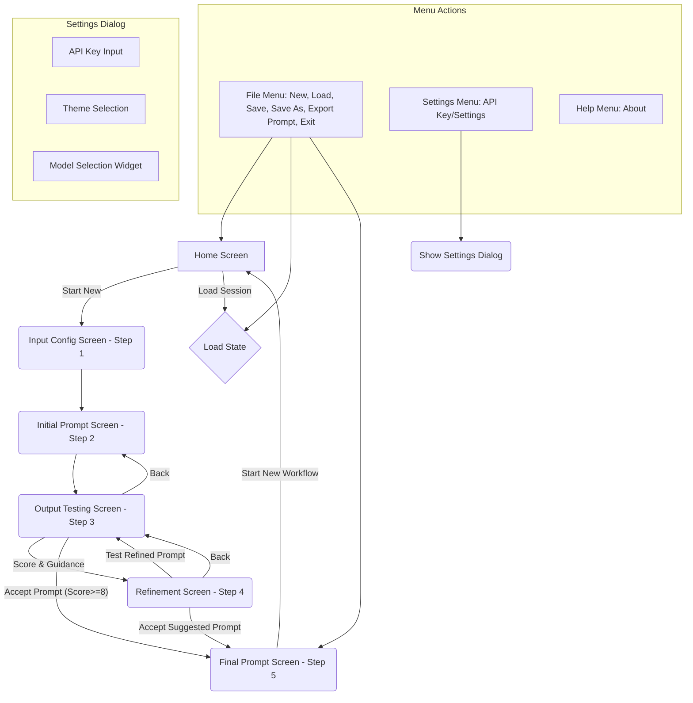

<!-- Zero Source Specification v1.0 -->
<!-- ZS:PROJECT_TYPE:DESKTOP_APPLICATION -->
<!-- ZS:PLATFORM:CROSS_PLATFORM -->
<!-- ZS:LANGUAGE:PYTHON -->
<!-- ZS:UI_TOOLKIT:PYSIDE6 -->
<!-- ZS:LIBRARY:LANGCHAIN -->
<!-- ZS:LIBRARY:GROQ -->
<!-- ZS:API:GROQ -->
<!-- ZS:COMPLEXITY:HIGH -->

# SystemProbe

## Description

SystemProbe is a desktop application designed to help users optimize Large Language Model (LLM) system prompts without needing to train or fine-tune the models themselves. It employs a dual-LLM strategy: one LLM (Refiner) analyzes prompt performance based on user examples and feedback, suggesting improvements, while a second LLM (Tester) executes the prompt to generate sample output for evaluation. Users iteratively refine the prompt based on scores and feedback until an optimal version is achieved. The application supports saving and loading refinement sessions and exporting the final optimized prompt.

## Functionality

### Core Workflow

The application guides the user through a multi-step workflow to refine a system prompt:

1.  **Home:** Start a new workflow or load a previous session. Configure the target LLM model via the Groq API.
2.  **Input Configuration (Step 1):** Define optional example user inputs and *required* corresponding ideal outputs. These examples provide context for the Refiner LLM and are crucial for evaluating prompt effectiveness.
3.  **Initial Prompt (Step 2):** Provide the starting system prompt to be tested.
4.  **Output Testing (Step 3):** The Tester LLM generates output based on the current system prompt (and potentially a random input example if provided). The user evaluates the output, assigning a score (0-10) and providing optional textual feedback/guidance.
5.  **Refinement (Step 4):** The Refiner LLM analyzes the previous prompt, the generated output, the score, user feedback, ideal outputs, and the history of previous attempts. It provides an analysis and suggests an improved system prompt. The user can accept the suggestion, re-run the Refiner (potentially with updated guidance), or go back.
6.  **Loop or Finalize:**
    *   If the user chooses to "Test Refined Prompt" (from Step 4), the suggested prompt becomes the current prompt, and the workflow returns to Step 3 (Output Testing).
    *   If the user chooses "Accept Prompt" (from Step 3 with a sufficiently high score) or "Accept Current Suggested Prompt" (from Step 4), the current/suggested prompt is marked as final.
7.  **Final Prompt (Step 5):** Displays the finalized, optimized system prompt. Allows copying to clipboard, saving as a text file, or exporting the entire session. The user can then start a new workflow.

### Key Features

*   **Dual LLM Refinement:** Uses separate Refiner (LLM A) and Tester (LLM B) roles for prompt optimization.
*   **Iterative Workflow:** Guides users through testing, scoring, feedback, and refinement cycles.
*   **Example-Driven:** Leverages user-provided input/output examples for context-aware refinement.
*   **Scoring & Feedback:** Allows quantitative (0-10 slider) and qualitative (text input) feedback to guide the Refiner LLM.
*   **Session Management:** Allows saving the entire workflow state (inputs, outputs, prompts, history, score, feedback) to a `.systemprobe` file and loading previous sessions.
*   **Prompt History Tracking:** Maintains a history of tested prompts, scores, and feedback within a session to help the Refiner avoid cycles.
*   **Groq Integration:** Utilizes the Groq API for fast LLM inference. Requires a Groq API key.
*   **Model Selection:** Allows users to select available LLM models from the Groq API (defaults provided) and view basic model details (context window, owner). Includes functionality to refresh the model list via the API.
*   **API Key Management:** Securely handles Groq API keys (prioritizes environment variable `GROQ_API_KEY`, falls back to secure storage via `QSettings`).
*   **Theme Support:** Offers configurable Dark (default) and Light themes for the user interface.
*   **Asynchronous Operations:** Uses background threads (`QThread`/`Worker`) for LLM calls and API requests to prevent UI freezing.
*   **Status Updates:** Provides feedback on ongoing operations via the status bar.
*   **Error Handling:** Displays user-friendly error messages for common issues (e.g., missing API key, LLM errors).
*   **Export:** Allows exporting the final optimized prompt to a `.txt` file and the full session state.

### User Interface Overview

The application utilizes a main window with a menu bar, status bar, and a central stacked widget that displays different screens corresponding to the workflow steps.



### Screen Descriptions

1.  **Home Screen:**
    *   Displays application title ("SystemProbe") and subtitle.
    *   Buttons: "Start New Workflow", "Load Existing Session".
    *   Includes a `ModelDetailsWidget` showing current LLM settings (dropdown for model selection, button to update model list from API, labels for context window/owner).
    *   Displays application version info.
2.  **Input Config Screen (Step 1):**
    *   Title: "Step 1: Define Inputs and Examples".
    *   Guidance labels explaining the purpose of the fields.
    *   Text Area 1: "User Input Examples" (Optional, multi-line, examples separated by `---`).
    *   Text Area 2: "Desired Output Examples" (Required, multi-line, examples separated by `---`). Must correspond to inputs if provided.
    *   Buttons: "Back" (to Home), "Next" (to Initial Prompt). Validates that at least one desired output is provided.
3.  **Initial Prompt Screen (Step 2):**
    *   Title: "Step 2: Set Initial System Prompt".
    *   Guidance label.
    *   Text Area: "Initial System Prompt" (Required, multi-line).
    *   Buttons: "Back" (to Input Config), "Start Testing" (to Output Testing). Validates that a prompt is entered.
4.  **Output Testing Screen (Step 3):**
    *   Title: "Step 3: Test Output and Evaluate".
    *   Label: Displays the specific "Input Used" for this test run (if applicable).
    *   Text Browser: Displays the output generated by the Tester LLM (LLM B). Placeholder text during generation/error.
    *   Evaluation GroupBox:
        *   Slider: Score (0-10).
        *   Label: Displays the current slider value.
    *   Optional Guidance GroupBox:
        *   Guidance label explaining feedback purpose.
        *   Text Area: "Optional Guidance for Refinement" (multi-line).
    *   Buttons: "Back (Edit Prompt)" (to Initial Prompt - *Note: Should likely go back to the prompt screen corresponding to the tested prompt, which might be Initial Prompt or a refined one. For simplicity, assume it allows editing the *current* prompt state*), "Refine Prompt" (to Refinement), "Accept Prompt" (requires score >= 8 recommended, shows confirmation if below 8, goes to Final Prompt).
    *   LLM B (Tester) is triggered automatically upon entering this screen. Buttons are disabled during generation.
5.  **Refinement Screen (Step 4):**
    *   Title: "Step 4: Analyze and Refine".
    *   Refiner Output GroupBox:
        *   Text Browser: Displays the analysis and the suggested new system prompt from the Refiner LLM (LLM A). Placeholder text during generation/error.
    *   Optional Guidance GroupBox:
        *   Guidance label explaining immediate use of feedback.
        *   Text Area: "Optional Guidance for Refinement" (multi-line, editable).
    *   Buttons: "Back (View Last Output)" (to Output Testing), "Refine Prompt" (re-runs LLM A with current guidance), "Test Refined Prompt" (updates current prompt with suggestion, goes to Output Testing), "Accept Current Suggested Prompt" (marks suggestion as final, goes to Final Prompt).
    *   LLM A (Refiner) is triggered automatically upon entering this screen. Buttons are disabled during generation. Test/Accept buttons are disabled if LLM A fails to provide a valid suggestion.
6.  **Final Prompt Screen (Step 5):**
    *   Title: "Step 5: Final Optimized System Prompt".
    *   Guidance label.
    *   Text Browser: Displays the accepted final system prompt (plain text).
    *   Buttons: "Copy to Clipboard", "Save Prompt (.txt)", "Export Session (.systemprobe)".
    *   Button: "Start New Workflow" (clears state, goes to Home).

### Behavior Specifications

*   **State Management:** The application maintains its state (inputs, outputs, prompts, history, scores, feedback, current step, session path) in a dedicated `StateManager`. State is loaded when the application starts or a session is loaded, and saved when navigating between screens or explicitly saving a session.
*   **Persistence:**
    *   Application settings (API Key, Theme, Model choice, etc.) are persisted using `QSettings` for platform independence.
    *   Session state is saved to and loaded from JSON files with a `.systemprobe` extension.
*   **Asynchronicity:** All LLM calls and API interactions (fetching models) are performed on background threads using a `Worker` class based on `QThread` to avoid blocking the UI. Signals are used for communication (result, error, progress, status).
*   **Error Handling:**
    *   Checks for Groq API key before making LLM calls; displays errors if missing.
    *   Catches exceptions during LLM calls and displays error messages to the user via dialog boxes and updates the status bar. Full tracebacks are printed to the console.
    *   Handles file I/O errors during session save/load.
*   **Input Validation:** Basic validation is performed (e.g., ensuring required fields like desired output examples and initial prompt are filled).
*   **Theme Application:** Themes (Dark/Light) are applied dynamically using QPalette and QSS stylesheets. Dialogs and message boxes also reflect the current theme.
*   **Navigation:** Screen transitions are managed by the `MainWindow`, calling `enter_screen` and `leave_screen` methods on the respective screen widgets to load/save state.
*   **History Tracking:** Each time the user proceeds from the Refinement screen (Step 4) to test a new prompt, an entry containing the *previous* prompt, its output, score, user feedback, and the Refiner's analysis is added to the session's history list. When a prompt is accepted (either from Step 3 or Step 4), a final entry marking acceptance is added.

## Technical Implementation

### Architecture

*   **UI Framework:** Desktop application built using Python and the PySide6 framework (Qt bindings).
*   **UI Structure:** Single main window (`QMainWindow`) containing a `QStackedWidget` to manage different screens (`QWidget` subclasses).
*   **Modularity:** Divided into screens, managers (`SettingsManager`, `StateManager`), an LLM integration handler (`GroqHandler`), utility widgets (`ModelDetailsWidget`), and worker threads.
*   **State Management:** Centralized `StateManager` holds the application's runtime data.
*   **Settings Management:** Centralized `SettingsManager` handles persistent application configuration using `QSettings`.
*   **LLM Interaction:** Abstracted within `GroqHandler`, utilizing the `langchain-groq` library for interacting with the Groq API.
*   **Concurrency:** Uses `QThread` (`Worker` class) for background tasks.
*   **Pattern:** Implements a dual-LLM refinement loop pattern.

### Core Components

*   **`main.py`:** Application entry point. Initializes QApplication, managers, and MainWindow. Applies the initial theme.
*   **`main_window.py`:** The main application window (`QMainWindow`). Manages screen navigation (via `QStackedWidget`), menus, status bar, theme application, session load/save operations, and dialog instantiation (Settings, About, Error).
*   **`settings_manager.py`:** Class responsible for saving and retrieving application settings (API key, theme, model selection, model cache) using `QSettings`.
*   **`state_manager.py`:** Class responsible for managing the active session's state dictionary, including inputs, outputs, prompts, history, scores, feedback, and current workflow step. Handles saving/loading state to/from `.systemprobe` JSON files. Emits signals (`state_loaded`, `state_cleared`, `prompt_history_updated`).
*   **`llm_integration/groq_handler.py`:** Handles all communication with the Groq API. Initializes `ChatGroq` client, defines methods to run the Tester (LLM B) and Refiner (LLM A) with specific contexts and prompts, fetches available models, gets model details, and cleans LLM output (removes Groq-specific tags).
*   **`workers.py`:** Defines `WorkerSignals` (for result, error, progress, status, finished) and a generic `Worker` (`QThread` subclass) to run functions in the background.
*   **`screens/base_screen.py`:** Abstract base class for all screen widgets, providing references to main window and managers, and defining standard methods (`enter_screen`, `leave_screen`, `load_state`, `save_state`).
*   **`screens/*.py`:** Individual screen implementations (Home, InputConfig, InitialPrompt, OutputTesting, Refinement, FinalPrompt) inheriting from `BaseScreen`. Each defines its UI layout and logic for interacting with state/LLM handler, typically using a `Worker` for LLM calls.
*   **`screens/settings_dialog.py`:** `QDialog` subclass for displaying and editing application settings. Uses `ModelDetailsWidget`.
*   **`widgets/model_details_widget.py`:** Reusable `QWidget` for selecting the LLM model, displaying its details, and updating the model list from the API using a `Worker`.

### Data Structures

1.  **Session State (`StateManager._session_state` dictionary):**
    ```python
    {
        "userInputExamples": List[str],        # User-provided input examples
        "desiredOutputExamples": List[str],    # Corresponding ideal outputs
        "promptHistory": List[Dict],           # History of refinement cycles (see below)
        "currentSystemPrompt": str,            # The prompt currently being tested or refined
        "finalSystemPrompt": Optional[str],    # The accepted, optimized prompt (None until accepted)
        "currentWorkflowStep": str,            # Identifier of the active screen (e.g., "home", "output_testing")
        "optionalGuidance": str,               # User feedback entered in Output Testing or Refinement screens
        "lastTesterOutput": str,               # Output generated by the last run of LLM B
        "lastScore": Optional[int],            # Score (0-10) assigned in the last Output Testing step
        "session_filepath": Optional[str]      # Full path if the session has been saved/loaded
    }
    ```
2.  **Prompt History Entry (Dictionary within `promptHistory` list):**
    ```python
    {
        "prompt": str,              # The system prompt that was tested
        "testerOutput": str,        # The output generated by LLM B for this prompt
        "score": Optional[int],     # The score given by the user
        "userFeedback": str,        # The optional guidance provided by the user for this cycle
        "refinerAnalysis": str      # The analysis provided by LLM A based on this test cycle
                                    # (or "N/A (Accepted)" / "N/A (Accepted suggestion)" for final entries)
    }
    ```
3.  **Settings (`SettingsManager` uses `QSettings` key-value store):**
    *   `groqApiKey`: string (API Key)
    *   `theme`: string ("dark" or "light")
    *   `llmModel`: string (Selected Groq model ID, e.g., "llama3-70b-8192")
    *   `useApiModels`: boolean (Flag indicating if API model list is used)
    *   `modelList`: string (JSON representation of the list of models fetched from API)
    *   `modelDetails_{model_id}`: string (JSON representation of details for a specific model)
    *   `lastModelUpdate`: int (Timestamp of last model list update)
    *   `fontSize`: int (Base font size - planned accessibility feature)

### LLM Integration (Groq)

*   **Library:** Uses `langchain-groq` for primary interaction and `groq` SDK for model listing/retrieval.
*   **Authentication:** Requires a Groq API key, preferably set via the `GROQ_API_KEY` environment variable, or configured in the Settings dialog.
*   **Models:** Defaults to `llama3-70b-8192` but allows selection from fetched Groq models. Excludes Whisper and PlayAi audio models.
*   **LLM Roles:**
    *   **Tester (LLM B):** Executes the `currentSystemPrompt`. Takes an optional `user_input` example. Its role is simply to follow the system prompt's instructions.
    *   **Refiner (LLM A):** Analyzes the performance of the last tested prompt and suggests improvements. It receives a detailed context including the goal, input/output examples, the tested prompt, the generated output, the user's score, user feedback, and the prompt history.
*   **Refiner LLM (A) System Prompt:**
    ```
    You are an expert System Prompt Refiner. Your goal is to analyze the performance of a given system prompt and suggest an improved version.
    You will be given:
    1. The overall goal.
    2. Example user inputs and their corresponding *ideal* outputs.
    3. The system prompt that was tested (`Tested System Prompt`).
    4. The output generated by another LLM using that tested prompt (`Generated Output`).
    5. A user's score (0-10, 10=perfect) for the generated output (`User Score`).
    6. Optional user feedback or guidance (`User Feedback`).
    7. A history of previously attempted prompts and their scores (`Prompt History`) to avoid cycles.

    Your task is to:
    1. Analyze why the `Generated Output` did or did not meet the requirements defined by the `Ideal Outputs` and the `User Score`.
    2. Consider the `User Feedback` for specific directions.
    3. Review the `Prompt History` to avoid suggesting prompts that failed previously.
    4. Generate a *new, improved* system prompt (`Suggested New System Prompt`) that is more likely to produce the `Ideal Outputs` for the given `Example Inputs`.
    5. Provide a brief analysis explaining your reasoning (`Analysis`).

    Output Format:
    Provide your response ONLY in the following format:

    Analysis:
    <Your analysis here>

    Suggested New System Prompt:
    <Your suggested system prompt here>
    ```
*   **Refiner LLM Input Construction:** The `GroqHandler` formats the context data (examples, last prompt, output, score, feedback, history) into a single `HumanMessage` sent alongside the Refiner System Prompt.
*   **Tester LLM (B) Input Construction:** The `GroqHandler` uses the `currentSystemPrompt` as the `SystemMessage`. If an input example is provided for the test, it's added in a `HumanMessage` instructing the LLM to consider it but generate based *only* on the System Prompt instructions. Otherwise, a simple `HumanMessage` asks for generation based on the System Prompt.
*   **Output Parsing:** The Refiner's output is parsed using regular expressions to extract the "Analysis" and "Suggested New System Prompt" sections based on the specified format.
*   **Output Cleaning:** A helper function (`_clean_groq_output`) Remove content between `<think>...</think>` tags (including the tags themselves) from LLM responses.

### Persistence

*   **Settings:** Uses `PySide6.QtCore.QSettings`, which provides platform-native storage (e.g., Registry on Windows, .plist on macOS, .ini files on Linux).
*   **Session Data:** Uses standard Python file I/O to save/load the `StateManager`'s state dictionary as a JSON file (`.systemprobe` extension). UTF-8 encoding is used.

### Threading

*   The `Worker` class (subclass of `QThread`) is used to execute potentially long-running functions (`llm_handler.run_tester_llm`, `llm_handler.run_refiner_llm`, `llm_handler.fetch_available_models`, `llm_handler.get_model_details`) off the main UI thread.
*   `WorkerSignals` are used to communicate results (`result`), errors (`error`), status updates (`status`), progress (`progress` - currently unused), and completion (`finished`) back to the UI thread safely.

### Dependencies / Libraries

*   **`PySide6`:** Required for the Qt GUI framework.
*   **`langchain-groq`:** Required for LangChain integration with the Groq API.
*   **`groq`:** Required for direct Groq API interactions (listing models, getting details).
*   **`langchain-core`:** Core LangChain components (prompts, messages). (Implicit dependency)

## Style Guide

*   **Themes:** Supports "dark" (default) and "light" themes. Theme selection is persistent via `QSettings`.
*   **Implementation:** Uses a combination of `QPalette` for basic colors and `QSS` (Qt Style Sheets) for more detailed styling of widgets (buttons, menus, text areas, sliders, group boxes, dialogs) in both dark and light modes. Disabled states are explicitly styled.

## Accessibility Requirements

*   **Theme Choice:** Dark/Light themes offer some contrast choice.
*   **Font Size:** Includes settings management for font size (`SettingsManager.get_font_size`/`set_font_size`), suggesting planned support, although live application might be complex. (Reference code shows commented-out UI elements for this).
*   Further accessibility features like full keyboard navigation or screen reader support are not explicitly detailed but should follow standard PySide6/Qt best practices.

## Testing Scenarios

The generated implementation should satisfy at least the following scenarios:

1.  **Complete Workflow:** Successfully navigate from Home -> Input Config -> Initial Prompt -> Output Testing -> Refinement -> Output Testing -> Final Prompt.
2.  **Session Save/Load:** Save a session mid-workflow (e.g., at Refinement step), close the app, reopen, load the session, and confirm the state (inputs, prompts, history, current screen) is restored correctly.
3.  **API Key Handling:**
    *   Run the application without an API key set; verify LLM calls fail gracefully with an error message.
    *   Set the API key via Settings dialog; verify LLM calls now succeed.
    *   Set the `GROQ_API_KEY` environment variable; verify it's used without needing dialog configuration.
4.  **Model Fetching:** Successfully fetch the model list from the Groq API via the Settings or Home screen widget and update the dropdown.
5.  **Refinement Loop:** Perform multiple Refine -> Test cycles, ensuring prompt history is updated and considered by the Refiner LLM.
6.  **Theme Switching:** Switch between Dark and Light themes via the Settings dialog and verify the UI updates correctly.
7.  **Error Handling:** Trigger an LLM error (e.g., invalid API key after initial setup) and verify an error dialog is shown.
8.  **Export Functionality:** Successfully export the final prompt to a `.txt` file and the session state to a `.systemprobe` file from the Final Prompt screen or File menu.
